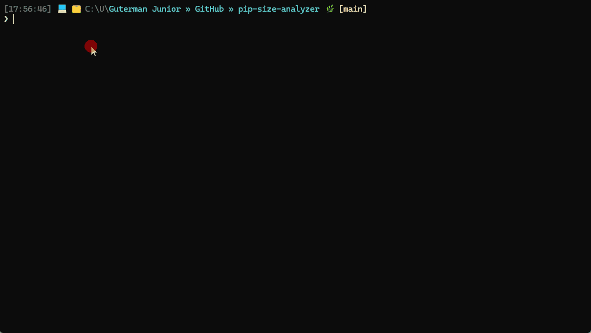

# 📦 pip-analyzer (repository: pip-size-analyzer)

> 🔍 Python package size analyzer with real-time metrics, smart caching, and CLI support.


---

## 🎬 Demo



---

## 📚 Documentation

Full documentation:

👉 https://gutermanjunior.github.io/pip-size-analyzer/

---

### 📂 Documentation Structure

The project includes a `/docs` directory with detailed documentation split by topic.

These files are used both for:

- GitHub browsing
- GitHub Pages (hosted documentation site)

---

### 🔗 Internal Documentation Links

You can access each section directly:

- [Installation](docs/installation.md)
- [Usage](docs/usage.md)
- [Architecture](docs/architecture.md)
- [Smart Cache](docs/cache.md)
- [Roadmap](docs/roadmap.md)

---

### 🧠 How this works

- The `README.md` provides a **high-level overview**
- The `/docs` folder provides **detailed explanations**

Each `.md` file inside `/docs` is:

- a standalone document
- accessible via GitHub
- rendered automatically by GitHub Pages

---

### 🌍 GitHub Pages Navigation

When accessing the hosted docs:

👉 https://gutermanjunior.github.io/pip-size-analyzer/

The `docs/index.md` acts as the **entry point**.

From there, users can navigate to:

- installation
- usage
- architecture
- and other sections

---

### 🎯 Why this structure

This separation allows:

- cleaner README (fast onboarding)
- deeper technical documentation
- easier future expansion

---

### ⚠️ Note

If you rename or move files inside `/docs`, make sure to update the links above to avoid broken navigation.

---

## 🚀 Overview

`pip-analyzer` is a PowerShell-based tool designed to analyze the size of Python packages installed in your environment (venv or global).

It provides:

- 📊 Real-time progress and performance metrics
- 📦 Package size analysis using `pip-size`
- ⚡ Smart caching based on environment state
- 🧠 Insight into dependency impact
- 🖥️ Dual interface: interactive and CLI

---

## 🆕 Release v1.2.0

Initial release of **pip-analyzer** as a standalone tool.

This version evolves the original script into a reusable and extensible solution, focusing on:

- Developer experience (DX)
- Observability
- Performance awareness

---

## ✨ Features

- 📦 Analyze installed Python packages (`pip list`)
- 📏 Calculate package sizes using `pip-size`
- 📊 Real-time progress with performance metrics:
  - Instant speed (Inst)
  - Average speed (Avg)
  - Moving average (Mov)
- 🧾 Flexible sorting options:
  - Name (alphabetical)
  - Size (descending)
  - Original order (`pip list`)
- 🧠 Smart cache based on environment state (`pip freeze`)
- 🖥️ Dual interface:
  - Interactive mode (guided prompts)
  - CLI mode (automation-friendly)
- 🏆 Top N largest packages (quick impact view)
- 📤 Export results:
  - CSV
  - JSON

---

## 🧠 Smart Cache

The cache system is based on the **state of your Python environment**.

### 🔍 How it works

1. Captures the environment snapshot:

   ```bash
   pip freeze
   ```

2. Generates a hash from this snapshot

3. Uses this hash as a cache key

## 🔒 Safety

This tool is read-only.

- Does not install or remove packages
- Does not modify your Python environment
- Only reads package metadata
- Cache is stored externally (optional)

---

### 🎯 Behavior

| Scenario            | Behavior        |
|--------------------|----------------|
| Same environment   | ⚡ Uses cache  |
| Updated package    | 🔄 Recalculate |
| New environment    | 🔄 New cache   |

---

### 💡 Why this matters

Traditional caching can become inconsistent when dependencies change.

This approach guarantees:
- correctness
- reproducibility
- performance

---

## ▶️ Usage

### Interactive mode

```powershell
.\pip-size.ps1
```

---

### CLI mode

```powershell
.\pip-size.ps1 -Sort Size -Top 10 -UseCache
```

---

### With export

```powershell
.\pip-size.ps1 -Sort Size -Export csv
```

---

## 📦 Installation

### 🪟 Windows

Run:

```powershell
.\install.ps1
```

This will:

- Install pip-analyzer in your user directory
- Add it to your PATH
- Make it globally available

---

### 🍎 macOS / 🐧 Linux

Run:

```bash
chmod +x install.sh
./install.sh
```

Then ensure your PATH includes:

```bash
export PATH="$HOME/.local/bin:$PATH"
```

---

## 🧹 Uninstall

### 🪟 Windows

```powershell
.\uninstall.ps1
```

---

### 🍎🐧 macOS / Linux

```bash
chmod +x uninstall.sh
./uninstall.sh
```

---

## 🌍 Global Usage

After installation, you can run:

```bash
pip-analyze -Sort Size -Top 10 -UseCache
```

from **any directory**.

---

## 📁 Installation Paths

| OS        | Location |
|----------|---------|
| Windows  | `%LOCALAPPDATA%\pip-analyzer` |
| macOS/Linux | `~/.local/share/pip-analyzer` |

---

## 🔒 Safety

- Does **not modify your Python environment**
- Does **not install or remove packages**
- Only reads metadata (`pip list`, `pip freeze`)
- Cache is stored outside project directories

---

## ⚙️ Parameters

| Parameter    | Description |
|-------------|------------|
| `-Sort`     | Name / Size / Original |
| `-Top`      | Top N largest packages |
| `-UseCache` | Enable smart cache |
| `-FastMode` | Skip size calculation (debug mode) |
| `-Export`   | csv / json |

---

## 📊 Example Output

```
Total packages: 57

numpy        1.26.0     12.3 MB
pandas       2.2.1      45.1 MB
requests     2.31.0     1.2 MB
```

---

## 📦 Requirements

- Python 3.x
- pip
- pip-size

Install dependency:

```bash
pip install pip-size
```

---

## 🌍 Global Usage (Run from Anywhere)

You can configure `pip-analyzer` to run from any directory, turning it into a global CLI tool.

---

### 🪟 Windows

#### 1. Move the script to a fixed location

Example:

```
C:\Tools\pip-analyzer\pip-analyze.ps1
```

---

#### 2. Add the folder to your PATH

Run in PowerShell:

```powershell
[Environment]::SetEnvironmentVariable(
  "PATH",
  $env:PATH + ";C:\Tools\pip-analyzer",
  "User"
)
```

Restart your terminal.

---

#### 3. (Optional) Create a PowerShell alias

Add to your `$PROFILE`:

```powershell
function pip-analyze {
    & "C:\Tools\pip-analyzer\pip-analyze.ps1" @args
}
```

---

### 🍎 macOS / 🐧 Linux

#### 1. Install PowerShell

macOS:
```bash
brew install powershell
```

Linux:
```bash
sudo apt install powershell
```

---

#### 2. Create a local bin directory

```bash
mkdir -p ~/.local/bin/pip-analyzer
```

---

#### 3. Copy the script

```
pip-analyze.ps1 → ~/.local/bin/pip-analyzer/
```

---

#### 4. Create a wrapper

Create file:

```
~/.local/bin/pip-analyze
```

With content:

```bash
#!/usr/bin/env pwsh
pwsh ~/.local/bin/pip-analyzer/pip-analyze.ps1 "$@"
```

---

#### 5. Make it executable

```bash
chmod +x ~/.local/bin/pip-analyze
```

---

#### 6. Add to PATH

```bash
export PATH="$HOME/.local/bin:$PATH"
```

---

### ✅ Result

You can now run:

```bash
pip-analyze -Sort Size -Top 10 -UseCache
```

from any directory.

---

## 🧠 Notes

- The tool analyzes the **current Python environment**
- It does **not modify your environment**
- Cache is stored globally (outside project folders)

---

## ⚠️ Limitations

- Depends on `pip-size` performance (network/cache dependent)
- No dependency deduplication (sizes may overlap)
- Represents package distribution size (wheel), not actual disk usage
- Sequential execution (no parallelism yet)

---

## 🛠️ Tech Details

- PowerShell 7+
- Regex-based parsing (tolerant approach)
- UTF-8 encoding handling
- Real-time terminal rendering (`Write-Progress`)
- Optimized collections (List<T>) to avoid O(n²)
- Environment-based caching strategy

---

## 🧩 Future Improvements

- ⚡ Parallel processing (multi-threaded)
- 📊 Visualization (charts / dashboards)
- 🔍 Dependency tree analysis
- 🧠 Advanced caching strategies
- 🌍 Cross-platform CLI (beyond PowerShell)

---

## 📄 License

MIT

---

## 👨‍💻 Author

Guterman Junior

---

## 🧩 Future Improvements (Technical Roadmap)

This section outlines potential future enhancements for `pip-analyzer`, including design considerations, trade-offs, and architectural impact.

These features are intentionally documented in detail to guide future development and maintain clarity on design decisions.

---

### ⚡ Parallel Processing Engine

#### 📌 Description

Introduce parallel execution for package size analysis using PowerShell 7 features (e.g., `ForEach-Object -Parallel` or runspaces).

Instead of processing packages sequentially:

```
pip-size pkg1 → pip-size pkg2 → pip-size pkg3
```

The tool would process multiple packages concurrently:

```
[pkg1, pkg2, pkg3, pkg4] → parallel workers
```

---

#### 🎯 Motivation

- Current execution is O(n) with external calls (`pip-size`)
- Performance degrades significantly with large environments
- Modern CPUs are underutilized

---

#### ✅ Advantages

- Significant speed improvement (2x–10x depending on environment)
- Better utilization of multi-core systems
- Improved user experience in large environments

---

#### ⚠️ Trade-offs / Challenges

- Breaks real-time ordered output
- `Write-Progress` is not thread-safe
- Metrics (Inst, Avg, Mov) need redesign
- Increased complexity (synchronization, aggregation)

---

#### 🧠 Architectural Impact

Would require splitting execution into:

1. **Parallel phase** → data collection
2. **Sequential phase** → rendering and metrics

---

---

### 📊 Advanced Progress System (Parallel-safe)

#### 📌 Description

Redesign progress tracking to support parallel execution.

Instead of relying on `Write-Progress` per iteration, use:

- shared counters
- periodic UI refresh
- aggregated status

---

#### 🎯 Motivation

- Current progress system assumes sequential execution
- Parallel execution would produce inconsistent output

---

#### ✅ Advantages

- Enables parallel processing without losing UX
- More stable and scalable UI updates

---

#### ⚠️ Trade-offs

- More complex implementation
- Less "live per-package feedback"

---

---

### 🧠 Enhanced Smart Cache (Incremental Cache)

#### 📌 Description

Improve cache granularity by storing per-package hashes instead of full environment hash.

Current model:

```
hash(pip freeze) → full cache
```

Proposed model:

```
package_name + version → cached size
```

---

#### 🎯 Motivation

- Current cache invalidates entirely on any change
- Inefficient for large environments with small updates

---

#### ✅ Advantages

- Partial cache reuse
- Faster updates after small changes
- Better scalability

---

#### ⚠️ Trade-offs

- More complex cache structure
- Risk of stale data if not carefully validated

---

---

### 🌳 Dependency Tree Analysis

#### 📌 Description

Analyze dependency relationships between packages.

Example output:

```
pandas
 ├── numpy
 ├── python-dateutil
 └── pytz
```

---

#### 🎯 Motivation

- Current tool shows size, but not dependency structure
- Hard to identify indirect heavy dependencies

---

#### ✅ Advantages

- Better insight into dependency impact
- Enables optimization decisions (e.g., removing heavy trees)

---

#### ⚠️ Trade-offs

- Requires integration with tools like `pipdeptree`
- Adds complexity to output rendering

---

---

### 📊 Visualization Layer (Charts / Dashboard)

#### 📌 Description

Add graphical output:

- pie charts (size distribution)
- bar charts (top packages)
- interactive dashboards

---

#### 🎯 Motivation

- Tabular output is informative but limited
- Visual representation improves comprehension

---

#### ✅ Advantages

- Better data interpretation
- Useful for presentations and reports

---

#### ⚠️ Trade-offs

- Requires additional dependencies (e.g., Python or JS tools)
- Moves away from pure CLI philosophy

---

---

### 🌍 Cross-platform Native CLI (Non-PowerShell)

#### 📌 Description

Provide a native CLI version (e.g., Python-based or compiled binary).

---

#### 🎯 Motivation

- PowerShell is not always available or preferred
- Broader adoption requires native tooling

---

#### ✅ Advantages

- True cross-platform compatibility
- Easier distribution (pip, brew, etc.)

---

#### ⚠️ Trade-offs

- Requires rewriting or wrapping logic
- Increased maintenance overhead

---

---

### 📦 Packaging & Distribution

#### 📌 Description

Distribute the tool via package managers:

- pipx
- Homebrew
- Chocolatey

---

#### 🎯 Motivation

- Manual installation is error-prone
- Users expect standard install methods

---

#### ✅ Advantages

- Easier adoption
- Standardized installation and updates

---

#### ⚠️ Trade-offs

- Requires packaging infrastructure
- Versioning and release management complexity

---

---

### 🧪 Benchmark Mode

#### 📌 Description

Add a mode to benchmark environment analysis performance.

Example:

```
pip-analyze --benchmark
```

Outputs:

- total time
- avg time per package
- slowest packages

---

#### 🎯 Motivation

- Helps identify bottlenecks (network/cache)
- Useful for performance tuning

---

#### ✅ Advantages

- Improves observability
- Useful for debugging performance issues

---

#### ⚠️ Trade-offs

- Adds complexity to metrics system

---

---

### 🔍 Filtering & Search

#### 📌 Description

Allow filtering results:

```
pip-analyze --filter numpy
pip-analyze --min-size 10MB
```

---

#### 🎯 Motivation

- Large outputs are hard to scan manually

---

#### ✅ Advantages

- Faster insights
- More targeted analysis

---

#### ⚠️ Trade-offs

- Additional parsing logic
- More CLI complexity

---

---

## 🧠 Final Notes

These features are intentionally not implemented yet to preserve:

- simplicity
- stability
- readability of the current version

The goal is to evolve `pip-analyzer` incrementally without compromising its core strengths:

- clarity
- observability
- low friction usage

---

## 🗺️ Roadmap Strategy

The features listed in the *Technical Roadmap* are not meant to be implemented all at once.

Instead, they represent a pool of possible improvements that must be **prioritized** before each release.

---

### 🧠 What "prioritization" means

Prioritization is the process of deciding:

- what features will be implemented next
- what features will be postponed
- what brings the most value with the least complexity

---

### ⚖️ How features are evaluated

Each feature should be considered based on two main factors:

#### 1. Impact

- Does it significantly improve user experience?
- Does it solve a real limitation of the tool?

#### 2. Implementation Cost

- How complex is the implementation?
- Does it introduce architectural changes?

---

### 📊 Priority Matrix

| Feature Type            | Impact | Cost | Priority |
|------------------------|--------|------|----------|
| Filtering / Search     | Medium | Low  | High     |
| Benchmark Mode         | Medium | Low  | High     |
| Parallel Processing    | High   | High | Medium   |
| Incremental Cache      | High   | High | Medium   |
| Visualization Layer    | Medium | High | Low      |

---

### 🎯 Example Roadmap Strategy

Instead of implementing everything at once:

#### ✅ Incremental approach (recommended)

**v1.3**
- Filtering (`--filter`, `--min-size`)
- Benchmark mode
- Small UX improvements

**v1.4**
- Parallel processing (structured)
- Improved progress system

---

### ⚠️ Why this matters

Trying to implement all features at once can lead to:

- increased complexity
- reduced stability
- slower development

A staged roadmap ensures:

- steady progress
- maintainable code
- consistent user experience

---

### 🧩 Philosophy

The goal is to evolve `pip-analyzer` incrementally, preserving its core strengths:

- clarity
- observability
- simplicity

while gradually adding more advanced capabilities.